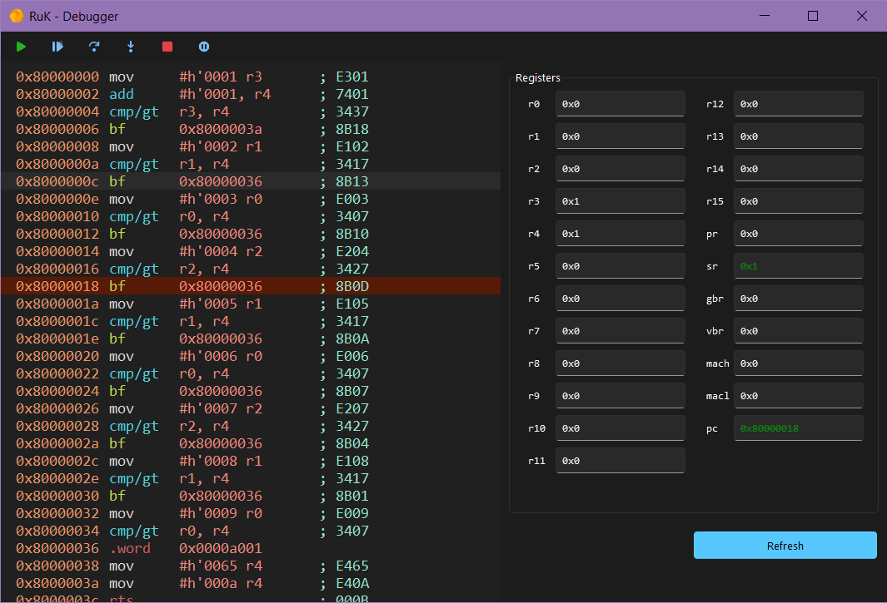

<h1 align="center">
  <br/>
  <br/>
</h1>
<p align="center">A simple <b>SuperH Emulator</b> that aim to help understanding SH4.<br/><br/>
Some features like <b>LCD display</b> and <b>Touchscreen</b> are planned, aiming to provide a more native debugging experience !</p>

## Overview
- Memory mapping features, with IO binding planned
- CPU backtrace on error
- Extensive instruction support, with a flexible code design
- GUI editor of the CPU registry
- Line selection, with easy "Move PC to line" on context menu

## Installation
You'll need Python3. No dependencies are used, simply run the "[test.py](test.py)" and get a simple rom to run OOTB :
````
python3 test.py
````

It should run fine under Windows, Linux, or even MacOS.

Support for binaries and custom ROM are planned.

## Using the GUI
As RuK is reaching the V1.0, a cool GUI is now work in progress !

You can test it right away :
````
python3 test_gui.py
````



This GUI make you able to both take a look at the assembly, and the registers values but also to edit the registers, in real time !
Try to edit the `pc` register value while running the code, and you'll see te magic.

It is also written in TK, using the excellent [rdbende/Sun-Valley-ttk-theme](https://github.com/rdbende/Sun-Valley-ttk-theme) TTK Theme, so do dependencies are expected.

The codebase is still a little messy, but a real clean will be done for the v1.0 !

## Unit Test Coverage
We believe that unit testing is a must for any software that's doing low level interaction or simulation. Core classes should always be covered by more than 80%, with no room for unclear behaviour. You should be able to run unit tests fine at every major release.

As we are progressing further to v1.0, Unit test are getting added not only for the Core but also for the GUI. Getting TK into Unit Testing wasn't as hard as we thought, and so far the "Registers Frame" is getting some partial coverage.


## Design choices
This project was made in pure-python, with no-dependencies as guideline because it was at first an idea to create a simple yet functional CPU emulator for anyone that's interested in SH4. 

Even if python isn't optimal for an emulator performance-wise, we thought that building an emulator in a rather beginner-friendly language would get more people interested into re-using the codebase and building their own tools with a robust core base !

Some CPU structs can be a little unexpected, like the long tuples unpacking, but they were taken from the early C design of RuK, that was supposed to be a simple disassembler for some Casio calculator.

Having it run on pc would certainly be better for you to work with and build than a odd-looking SH4-compiled ELF program...

> *Side note*: It's one of my first big project with python TK. Most of my experience on UI was done with Java, or some more "Electron-ish" framework. I wanted to make a custom Python wrapper arround DirectX or SKIA and get some smooth rendering but realized that wouldn't be simple to maintain ... Maybe my code is full of TK weirdness, so feel free to PR those out !

## Helping
Any idea that could help this project getting better and more robust are welcome !  

You can help this project by reviewing code, making stronger unit tests or even proposing PR for new features !

If you've a good idea but don't know how to implement it, feel free to open an Issue with the "Feature Request" tag.

